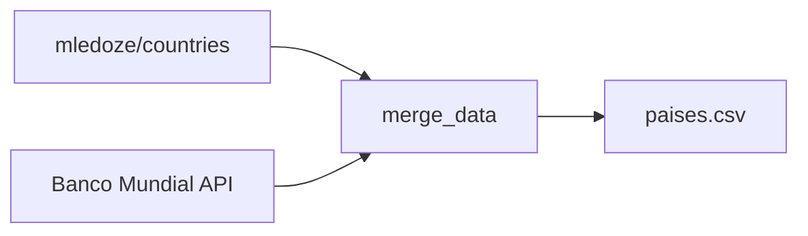

# Informe teórico — Gestión de datos de países

**Trabajo Práctico Integrador (TPI)**  
**Materia:** Programación 1  
**Proyecto:** Sistema de gestión de datos de países en Python

---

## 1. Introducción

En este informe se explican los conceptos de programacion aplicados para hacer esta app. La aplicaciion te deja cargar datos desde un archivo CSV, hacer consultas (búsquedas y filtros), ordenar registros, calcular estadísticas y persistir los cambios en el archivo csv (simulando algo que haria normalmente una DB)

La estructura de datos central del proyecto es una **lista de diccionarios**, donde cada diccionario representa un país con sus atributos: nombre, población, superficie y continente.

---

## 2. Listas

### Definición

Las listas se utilizan para almacenar varios elementos en una sola variable.

" Las listas son uno de los cuatro tipos de datos integrados en Python que se utilizan para almacenar colecciones de datos. Los otros tres son las tuplas, los conjuntos y los diccionarios, cada uno con características y usos diferentes. Las listas se crean utilizando corchetes "
-
de: https://www.w3schools.com/python/python_lists.asp

### Aplicación en el proyecto

Al iniciar el programa, la función `load_countries()` lee el archivo `paises.csv` y construye una lista vacía que se va llenando con un diccionario por cada fila del archivo:

```python
countries = []
for line_number, row in enumerate(reader, start=2):
    countries.append({
        "nombre": row["nombre"].strip(),
        "poblacion": int(row["poblacion"]),
        "superficie": int(row["superficie"]),
        "continente": row["continente"].strip(),
    })
```

Durante la ejecución, esta lista se mantiene en memoria como fuente de verdad. Las operaciones del menú (agregar, actualizar, filtrar, ordenar) trabajan sobre ella. Cuando hay cambios que queremos guardar, se llama a `save_countries(countries)` para guardar la lista completa al CSV.

### Operaciones utilizadas

- **`append()`** — agregar un país nuevo al final de la lista
- **`len()`** — contar cuántos países hay cargados
- **`sorted()`** — crear una nueva lista ordenada sin modificar la original
- **Comprensión de listas** — generar subconjuntos filtrados de forma concisa:

```python
results = [c for c in countries if c["continente"] == continent]
```

Esta línea equivale a:

```python
results = []
for c in countries:
    if c["continente"] == continent:
        results.append(c)
```

---

## 3. Diccionarios

### Definición

"Los diccionarios se utilizan para almacenar valores de datos en pares clave-valor.

Un diccionario es una colección ordenada*, modificable y que no permite duplicados."

de: https://www.w3schools.com/python/python_dictionaries.asp

### Aplicación en el proyecto

Cada país se modela como un diccionario con cuatro claves fijas:

```python
{
    "nombre": "Argentina",
    "poblacion": 45696159,
    "superficie": 2780400,
    "continente": "América",
}
```

Las claves coinciden con las columnas del CSV, lo que facilita la lectura y escritura del archivo.

### Acceso a valores

```python
country["nombre"]       # acceso directo por clave
country["poblacion"]    # te da 45696159
country.get("continente", "Desconocido")  # acceso seguro con valor por defecto
```

---

## 4. Funciones

### Definición

" Una función es un bloque de código que solo se ejecuta cuando se la llama.
Una función puede devolver datos como resultado.
Una función ayuda a evitar la repetición de código. "

de: https://www.w3schools.com/python/python_functions.asp

### Ventajas de la modularización

- **Reutilización:** `read_positive_int()` se usa al agregar y al actualizar países si necesidad de escribir una y otra vez el mismo codigo y se puede llamar de distintos lugares. 
- **Legibilidad:** `filter_by_continent()` expresa su intención sin leer 30 líneas de `main()`
- **Mantenimiento:** un cambio en la validación de entrada se hace en un solo lugar
- **Prueba:** a cada función  se la puede verificar de forma aislada

### Funciones del proyecto agrupadas por responsabilidad

| Grupo | Funciones | Responsabilidad |
|-------|-----------|-----------------|
| Persistencia | `load_countries`, `save_countries` | Leer y escribir el CSV |
| Entrada | `read_text`, `read_positive_int`, `read_continent`, `read_range` | Validar datos del usuario |
| Consulta | `find_country_index`, `search_country` | Buscar países |
| Filtrado | `filter_by_continent`, `filter_by_population`, `filter_by_area` | buscar por criterio |
| Presentación | `display_countries`, `show_menu` | Mostrar datos en la terminal |
| Análisis | `show_statistics`, `sort_countries` | Estadísticas y ordenar |
| Control | `main` | loop principal del menú |

### Funciones anónimas (`lambda`)

En el ordenamiento se usan funciones pequeñas sin nombre para indicar a `sorted()` qué valor comparar:

```python
sort_key = (
    (lambda c: c[field].casefold())
    if field == "nombre"
    else (lambda c: c[field])
)
sorted_countries = sorted(countries, key=sort_key, reverse=descending)
```

Equivale a definir una función que, dado un país, devuelve el valor por el cual ordenar.

---

## 5. Condicionales

### Definición

Las estructuras **condicionales** son mecanismos que te permiten ejecutar código solo cuando se cumple una condición. En Python se utilizan principalmente `if`, `elif` y `else`.

### Tipos de uso en el proyecto

#### Validación de entrada

```python
if not text:
    print("Error: el campo no puede estar vacio.")
    continue

if number <= 0:
    print("Error: debe ingresar un numero entero positivo.")
    continue
```

#### Control del menú principal

```python
if option == "1":
    add_country(countries)
elif option == "2":
    update_country(countries)
elif option == "0":
    print("Hasta luego.")
    break
else:
    print("Error: opcion no valida.")
```

#### Filtrado de datos

```python
if minimum <= c["poblacion"] <= maximum:
    # el país cumple el rango
```

#### Verificación de existencia

```python
if find_country_index(countries, name) is not None:
    print(f"Error: ya existe un pais con el nombre '{name}'.")
    return
```

#### Expresión condicional (operador ternario)

```python
descending = order == "2"
direction = "descendente" if descending else "ascendente"
```

### Manejo de errores

El proyecto usa condicionales junto con `try/except` para evitar que el programa se cierre ante datos inválidos:

```python
try:
    countries = load_countries()
except (FileNotFoundError, ValueError) as error:
    print(f"Error al iniciar: {error}")
    return
```

---

## 6. Ordenamientos

### Definición

**Ordenar** Ordenar algun dato según un criterio (nombre, población, superficie) y en un sentido (ascendente o descendente).

### Función `sorted()` en Python

Python provee la función built-in `sorted()`, que recibe:

| Parámetro | Descripción |
|-----------|-------------|
| `iterable` | La colección a ordenar (la lista de países) |
| `key` | Función que extrae el valor a comparar de cada elemento |
| `reverse` | `False` = ascendente, `True` = descendente |

### Ordenamiento por nombre

Los nombres son cadenas de texto. Para ignorar mayúsculas/minúsculas se usa `.casefold()`:

```python
sorted(countries, key=lambda c: c["nombre"].casefold())
```

### Ordenamiento por valores numéricos

Para población y superficie se compara directamente el entero:

```python
sorted(countries, key=lambda c: c["poblacion"], reverse=True)
```

### Comportamiento importante

`sorted()` **no modifica** la lista original; devuelve una **nueva lista** ordenada. Esto es adecuado para mostrar resultados sin alterar el orden interno de los datos cargados.

---

## 7. Estadísticas básicas

### Definición

Las **estadísticas básicas** te muestran un resumen de algunos de los numeros como máximo, mínimo y promedio. Acá se calculan sobre los campos `poblacion` y `superficie`.

### Medidas implementadas

| Medida | Descripción | Implementación |
|--------|-------------|----------------|
| Máximo | Valor más alto del conjunto | `max(countries, key=lambda c: c["poblacion"])` |
| Mínimo | Valor más bajo del conjunto | `min(countries, key=lambda c: c["poblacion"])` |
| Promedio | Suma dividida por cantidad | `sum(...) / len(countries)` |
| Conteo por categoría | Cuántos países hay por continente | diccionario acumulador |

### Cálculo del promedio

```python
avg_population = sum(c["poblacion"] for c in countries) / len(countries)
```

La expresión `sum(c["poblacion"] for c in countries)` recorre todos los países y suma sus poblaciones. Luego se divide por la cantidad total para obtener el promedio.

### Máximo y mínimo con contexto

A diferencia de calcular solo el número, el proyecto usa `max()` y `min()` sobre la lista de diccionarios para obtener **el país completo** asociado al valor extremo:

```python
max_pop = max(countries, key=lambda c: c["poblacion"])
print(f"Mayor poblacion: {max_pop['nombre']} ({max_pop['poblacion']:,})")
```

Así el usuario ve tanto el valor como el nombre del país correspondiente.

### Conteo por continente

```python
count_by_continent = {}
for country in countries:
    continent = country["continente"]
    count_by_continent[continent] = count_by_continent.get(continent, 0) + 1
```

Esto produce un resumen como:

```
África: 58
América: 56
Asia: 51
Europa: 44
Oceanía: 16
```

---

## 8. Archivos CSV

### Definición

**CSV** " Los archivos CSV (del inglés Comma Separated Values) son un tipo de documento en formato abierto sencillo para representar datos en forma de tabla, en la que las columnas se separan por comas. " 

de: https://en.wikipedia.org/wiki/Comma-separated_values

### Estructura del archivo del proyecto

```csv
nombre,poblacion,superficie,continente
Argentina,45696159,2780400,América
Japón,123975371,377969,Asia
Brasil,211998573,8510420,América
```

- **Primera fila:** encabezados (nombres de columnas)
- **Filas siguientes:** un país por línea
- **Tipos:** nombre y continente son texto; población y superficie son enteros

### Lectura con `csv.DictReader`

El módulo `csv` de Python facilita la lectura asociando cada columna a su encabezado:

```python
import csv

with CSV_FILE.open(encoding="utf-8") as file:
    reader = csv.DictReader(file)
    for row in reader:
        # row es un diccionario: {"nombre": "...", "poblacion": "...", ...}
```

`DictReader` convierte cada fila en un diccionario cuyas claves son los encabezados del CSV.

### Escritura con `csv.DictWriter`

```python
with CSV_FILE.open("w", newline="", encoding="utf-8") as file:
    writer = csv.DictWriter(file, fieldnames=FIELDS)
    writer.writeheader()
    writer.writerows(countries)
```

### Validaciones al leer

El programa verifica:

1. Que el archivo exista
2. Que las columnas sean exactamente las esperadas
3. Que los valores numéricos se puedan convertir a `int`
4. Que no falten campos en ninguna fila

Si alguna validación falla, se muestra un mensaje claro indicando el tipo de error y, cuando es posible, la línea afectada.

### Origen de los datos

El archivo `paises.csv` se genera con `generar_datos.py` a partir de dos fuentes abiertas:

- **Banco Mundial:** población y superficie
- **mledoze/countries:** nombres en español y continente

Los registros se combinan por código ISO-3166 alpha-3. Detalle completo en `FUENTES.md`.

---

## 9. Flujo de operaciones principales

### Flujo de carga de datos (inicio)

```
paises.csv  →  csv.DictReader  →  lista de diccionarios  →  memoria (countries)
```

### Flujo de persistencia (alta o actualización)

```
Usuario ingresa datos  →  validación  →  modificar lista  →  save_countries  →  paises.csv
```

### Flujo de filtrado

```
Lista completa  →  recorrer cada país  →  evaluar condición  →  nueva lista filtrada  →  display_countries
```

### Flujo de generación del dataset



1. Descargar lista maestra de países (mledoze)
2. Descargar población y superficie (Banco Mundial)
3. Combinar por código ISO3
4. Descartar registros incompletos
5. Guardar en `paises.csv`

---

## 10. Bibliografía

- Python Software Foundation. (2026). *The Python Tutorial — Data Structures*. https://docs.python.org/3/tutorial/datastructures.html
- Python Software Foundation. (2026). *csv — CSV File Reading and Writing*. https://docs.python.org/3/library/csv.html
- Banco Mundial. (2026). *World Development Indicators*. https://data.worldbank.org/
- Ledoze, M. (2026). *Countries of the world* [Dataset]. GitHub. https://github.com/mledoze/countries
- Dawson, M. (2010). *Python Programming for the Absolute Beginner* (3rd ed.). Course Technology PTR.

---

*Cualquier otra duda que tengan lo pueden leer en el readme principal y las fuentes md.*
